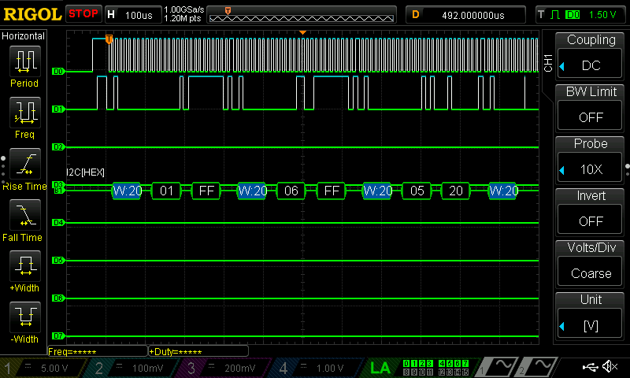
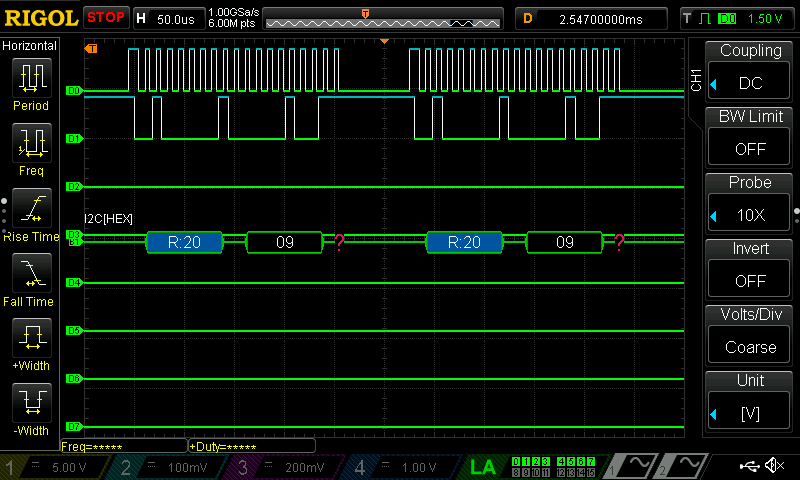

# Notes and Writeup for Checkoff

## Proficiency Specs

### Specs that were not met:
Most of the following specs were not met due to time constraints along with their other considerations.

- Making an output filter that is tunable
  - The tunable output filter also was not added becuase it would have changed the architecture of the FPGA considerably. It would have added a clock domain crossing along with more shared DSP blocks. 

- Arpegiation
  - Arpegiation should be simple to implement but we unfortunately ran out out time. This would be handled on the MCU but would involve implementing RTOS or interrupts to handle switching between notes.
 
- Envelope Generation
  - Our idea to do envelope generation involved sending a pwm signal to our amplification circuit to change the volume. This was not possible due to using an amp internal to a speaker  

- I2C Button Expander
  - The I2C Button expander was not used. This was due to spending around 20 hours trying to get it to work. Transactions worked periodically however it was not consistent enough to be considered functional.
 
  - This is a working I2C communication.
 
  

  

- Here is a continously reading transaction, but the peripheral never sends an ACK bit.

  

  

