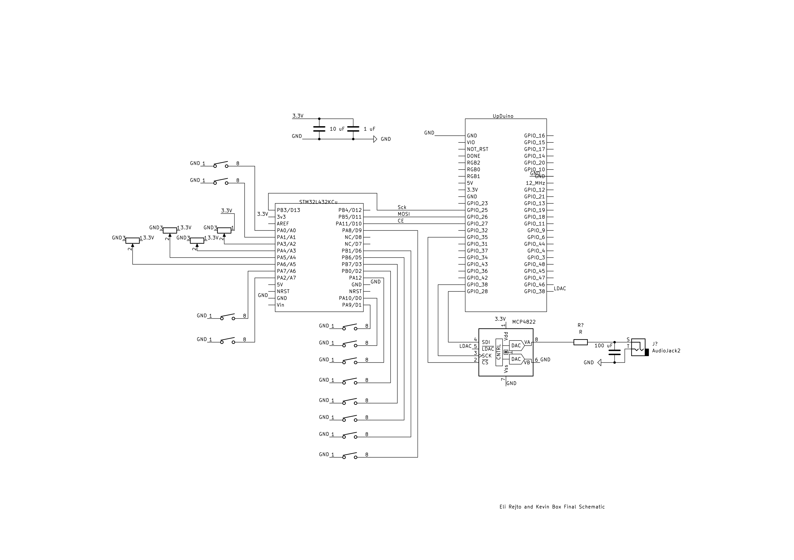

# Schematics
<!-- Include images of the schematics for your system. They should follow best practices for schematic drawings with all parts and pins clearly labeled. You may draw your schematics either with a software tool or neatly by hand. -->

The circuit has three main parts: the MCU, the FPGA, and the SPI DAC. All three are connected via SPI and the buttons are attached directly to the MCU GPIO Pins.

  

# Source Code Overview
<!-- This section should include information to describe the organization of the code base and highlight how the code connects. -->

The source code for the project is located in the Github repository [here](https://github.com/ERejto/FPGA_Synthesizer).

# Bill of Materials
<!-- The bill of materials should include all the parts used in your project along with the prices and links.  -->

| Item | Part Number | Quantity | Unit Price | Link |
| ---- | ----------- | ----- | ---- | ---- |
|  I2C input expander |  MCP23008-E/P-ND | 4 | $1.54 |  [MCP23008](https://www.digikey.com/en/products/detail/microchip-technology/MCP23008-E-P/735951) |
| 10k 1/20W Rotary Potentiometer | 987-1649-ND | 6 | $2.51 | [FC15BR10K](https://www.digikey.com/en/products/detail/tt-electronics-bi/P0915N-FC15BR10K/4780740) |
| 10k 1/10W Slide Potentiometer | PTA2043-2015CPB103-ND | 6 | $1.71 | [PTA2043](https://www.digikey.com/en/products/detail/bourns-inc/PTA2043-2015CPB103/3781176) | 
| 12 bit SPI -> DAC | MCP4822-E/P-ND | 2 | $4.28 | [MCP4822](https://www.digikey.com/en/products/detail/microchip-technology/MCP4822-E-P/951465) |
| 16 bit 12S -> DAC | PCM1725U | 2 |  $6.21 | [PCM1725U](https://www.digikey.com/en/products/detail/texas-instruments/PCM1725U/266113) | 
| .22 uF Capacitor | C322C224K5R5TA | 1 | $0.36 | [C322C224K5R5TA](https://www.digikey.com/en/products/detail/kemet/C322C224K5R5TA/818129?utm_adgroup=General&utm_source=google&utm_medium=cpc&utm_campaign=PMax%20Shopping_Product_Zombie%20SKUs&utm_term=&utm_content=General&utm_id=go_cmp-17815035045_adg-_ad-__dev-c_ext-_prd-818129_sig-CjwKCAiA98WrBhAYEiwA2WvhOp8smfIAbqDaWpT1sOhDM8XLcz0bRCDB6kGSJnp--Ci0fapCdgxQahoCFn8QAvD_BwE&gad_source=1&gclid=CjwKCAiA98WrBhAYEiwA2WvhOp8smfIAbqDaWpT1sOhDM8XLcz0bRCDB6kGSJnp--Ci0fapCdgxQahoCFn8QAvD_BwE) | 
| 10 uF Capacitor | C322C106K3R5TA | 1 | $0.79 | [C322C106K3R5TA](https://www.digikey.com/en/products/detail/kemet/C322C106K3R5TA/6562379?utm_adgroup=&utm_source=google&utm_medium=cpc&utm_campaign=PMax%20Shopping_Product_Medium%20ROAS%20Categories&utm_term=&utm_content=&utm_id=go_cmp-20223376311_adg-_ad-__dev-c_ext-_prd-6562379_sig-CjwKCAiA98WrBhAYEiwA2WvhOmpwLSOmYx4mipdkroVNfaqsUpcP0VC3hJqmt-B-ogxktoCUDBqWchoCdCAQAvD_BwE&gad_source=1&gclid=CjwKCAiA98WrBhAYEiwA2WvhOmpwLSOmYx4mipdkroVNfaqsUpcP0VC3hJqmt-B-ogxktoCUDBqWchoCdCAQAvD_BwE)|
| 1K Resistor | CF14JT1K00 | 1 | $0.1 | [CF14JT1K00](https://www.digikey.com/en/products/detail/stackpole-electronics-inc/CF14JT1K00/1741314)|
| White Arcade Buttons | OBSC-24-CW | 12 | $3.95 | [OBSC-24-CW](https://paradisearcadeshop.com/products/sanwa-obsc-24-snap-in-button-clear-white?variant=34672638591138)|

<!-- Need to add amp, speaker, buttons, and any resistors/caps used in final production -->

**Total cost: $101.11**

# References 

Website Title, Short Description. [link]()
