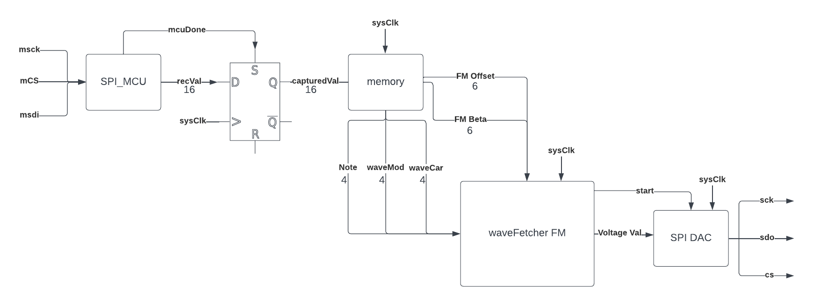
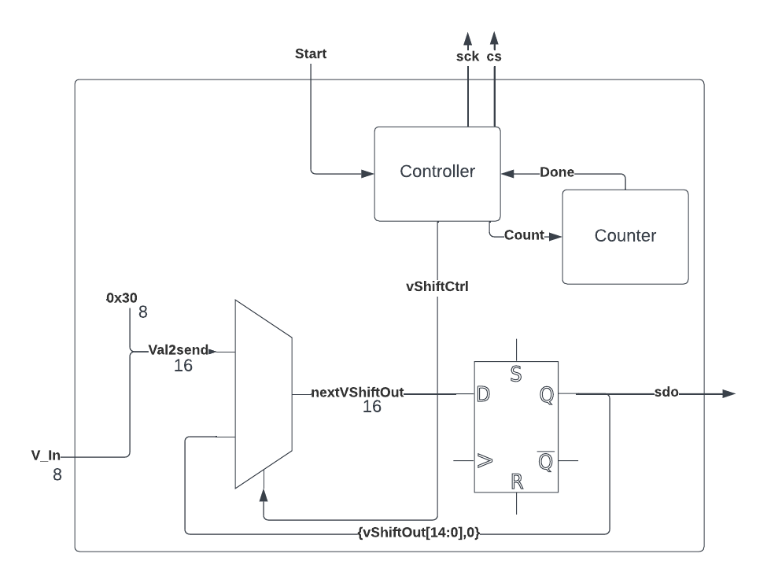
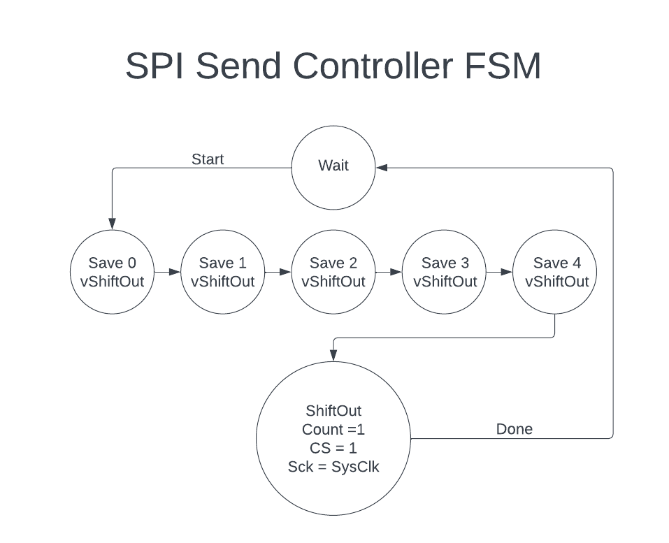

# FPGA Design

The FPGA is used to generate waveforms and perform DSP on produced wave in accordance with the settings sent over by the MCU. It contains blocks to receive information over SPI from the MCU, save relevant settings recived from the MCU, generate the waves, *filter the resultant wave*, and send the wave over SPI to a DAC. The design is clocked at 12 MHz and *the sampling rate for the waves is 48kHz.*

  

## Table of Contents

[MCU SPI In](#MCU-SPI-IN)  
[Settings Memory](#Settings-Memory)    
[Wave Generation](#Wave-Generation)   
[Filtering](#Filtering)   
[SPI to DAC](#SPI-to-DAC)

## MCU SPI In 

This block reads information coming from MCU over SPI and sends it to the memory.    

| Block Diagram | FSM|
|---------|------|
|
 
| 
 
|

The MCU sends 16 bits to the FPGA over the spi link. The 16 bits (recVal) are divided into different parts depending on the type of send. The most significant byte is always the memory destination, the bottom 12 bits contain information. To play a note at a given frequency address 0x0 is used. With address zero the next byte is the note, followed by 2 bytes that determine the wave type of the modulation and wavetype of the carrier. (See [frequency modulation (FM)](#frequency-modulation) for more info). Addresses 0x1 and 0x2 are settings addresses, and save 2 values, 6 bits each to the settings register. See below for configurations. Currently only 3 different adresses are used so there is room for more configurations or settings to be sent/saved.

**Play note**
| Addr | Note | Carrier Wave | Modulation Wave |
|------|------|--------------|-----------------|
|recVal[15:12]|recVal[11:8]|recVal[7:4]|recVal[3:0]|
|0x0|0x0-C|0x0-3|0x0-3|

Currently 12 different notes can be played with note = 0x0 turning the wave generation off. They are enumerated as follows, c4=0x1, cS4=0x2, d4=0x3, dS4=0x4, e4=0x5, f4=0x6, fS4=0x7, g4=0x8, gS4=0x9, a4=0xA, aS4=B, b4=C. The wavetypes currently able to be used are sine, square, triangle, and sawtooth. They are enumerated as sine = 0x0, sawtooth = 0x1, square = 0x2, and triangle = 0x3.
There is some room to add more playable notes or a lot more waveypes. 

**Update Settings**

Settings can use the full range of 6 bits provided to them from 0b000000-0b111111.
| Addr | Setting 1 | Setting 2|
|------|------|--------------|
|recVal[15:12]|recVal[11:6]|recVal[5:0]|
|0x1|FM Beta Value|FM Frequency Offset|
|0x2| Filter Setting| unused|

## Settings Memory 

The settings memory is a simple module that saves that recieved value from SPI to the correct location. It works by enabling flops based on the recieved address. This might not be the best or most efficient way to do this but works for our purposes. The settings memory drives outputs for each setting constantly. Can be thought of as a big bank of enabled flops.

## Wave Generation 

Wave generation is the main block of the FPGA and is what the rest of the system is driven around. It built of [phase accumulators](#phase-accumulation) and [wave tables](#wave-tables) to generate the final wave. Two of each are needed, one each to drive the frequency modulator and one each to determine the main wave. The general idea is that the phase accumulator creates an index that changes variably based on the frequency desired and the index is used to fetch the value of the wave at the given index.

  

### Phase Accumulation

Phase Accumulation is used to fetch waves at varying frequencies. This is done using a 32 bit accumulator and then using the top 8 bits of the accumulator as an index. A value is added to accumulator every clock cycle and an index is genereated. This index is then passed to the wavetable to fetch a value a the given index/timestep. The frequency that is generated depends on the value added to the accumulator every cycle and for a given frequency, the value (addVal) is given by:
$$addVal = \frac {(k*f_{des})}{f_{clk}}$$
Where $k$ is a constant given by the actual value of one index ($indexVal$) times the maximum value of the index, ($indexes$), $k = indexVal * indexes$. In our case,
$indexVal = 0x01000000, 0d16777216$ and $indexes = 256$. This is because the index is the upper 8 bits of a 32 bit accumulator.  

### Wave Tables

The wave tables are simple modules that take in an index and return a voltage value given by the pregenerated wave table. The different wave tables have different values at different indicies based on their wave shape. The wave tables are currently implemented as ROM and inferred with LUTs. This could be changed to BRAM to free up more LUTs but is a simpler implementation. The outputs of the different wave types are then muxed depending on the settings from settings memory.

<!--links to wave table .txt-->

###  Frequency Modulation

Frequency modulation is a way to change to sound, or wave characteristics, of a given wave. The original wave, or carrier wave, is modulated by a different wave, a modulation wave, to produce a final wave. See below for an example. The formula for a frequency modulated wave $V(t)$ is given by    
$$V(t) = sin (2 \pi f_c t + \beta sin(2 \pi f_m t))$$
Where $f_c$ and $f_m$ and the frequency of the carrier wave and modulation wave respectively. $\beta$ is a constant that determines how much the modulation affects the carrier. This comes from the settings memory and therefore the MCU. In implemenattion this uses 2 phase accumulators, 2 wave tables, and a multiply-add block. Every cycle, the modulation wave is generated, $sin(2 \pi f_m t)$, then it is multiplied by $\beta$ and added to the carrier accumulator. A $\beta = 0$ turns frequency modulation off. 

<!-- reference matlab -->

## Filtering   

*to be implemented*

<!-- 0-x number of IIR filters pregenerated, run at 48kHz so start with decimation and then to simple one with high frequency pass and low number of stages, then can add more -->

## SPI to DAC

This block sends voltage values to the SPI DAC every time a new voltage value is generated. 

| Block Diagram | FSM|
|---------|------|
|
 
| 
 
|

Due to the way the SPI DAC works, SPI sends are configured in the following way
|Control Bits|Value|
|---|---|
val2Send[15:12]|val2Send[11:0]|
0x3|0x0(volVal)|

This gives the output of the DAC on channel A with no gain in constant conversion mode. The DAC has space for 12 bits of voltage value but only 8 bits are generated (volVal) so, the lower 8 bits of val2Send is used. 

See the [MCP4921](https://ww1.microchip.com/downloads/en/DeviceDoc/22248a.pdf) for more information on sending values.

