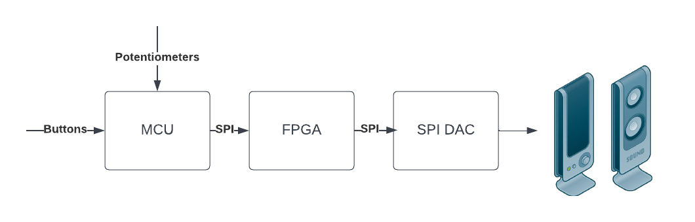

  

## Project Abstract
We are proposing to build a digital synthesizer to play different kinds of music. This takes inputs from a series of potentiometers for different settings and then plays different sounds when one of eighteen buttons (keys) are pressed.

Specs: MCU communicates with 8 bit in-out expander with serial interface MCP23008 MCU reads values from potentiometers 3 potentiometers with different functions = proficiency 5 potentiometers with different functions = mastery MCU sends analog values to a speaker FPGA implements signal filtering FPGA implements envelope generation FPGA implements modulation (amplitude = proficiency, frequency = excellence)

The FPGA will take care of the digital signal processing algorithms, applying the filtering, envelope generation, and modulation to the notes generated by key presses. This is the meat of the project and where most of the work will likely take place. This includes the riskiest part of the project, doing frequency modulation on the fpga. We are not sure what this might entail but seems complicated as of now so could potentially give us the most trouble.

The MCU will handle all the communications to peripherals. It will read in values from button presses through an I2C in out expander along with potentiometers and a speaker or amplifier connected to a speaker. This will be a simpler part of the project but we ideally will be able to keep adding on peripherals for more functionality. The MCU also communicates with new hardware in the MCP23008.

## The Team

### Kevin Box: 

Engineering major at Harvey Mudd College interested in RTL microarcitecture and embbeded systems. Played soccer for CMS during his time at HMC and likes to ski and travel when not busy.

### Eli Reijto:

Engineering major at Harvey Mudd College interested in embedded design and music. PLayed baseball for CMS during his time at HMC and likes cook and DJ when not busy. 

## Project Overview

### Project Video

<iframe width="560" height="315" src="https://youtube.com/embed/fKF9fMeEQIw?feature=share" title="YouTube video player" frameborder="0" allow="accelerometer; autoplay; clipboard-write; encrypted-media; gyroscope; picture-in-picture" allowfullscreen></iframe>

### Project Motivation
Both of us have been interested in music and wanted to do a project that combined our interest in music and our interest in engineering. We thought that a digital synth would be a great combination of these two topics and a way to improve our MicroP's skills.

### System Block Diagram

  

### Acknowledgement 

We would like to thank Prof. Brake for sticking with the class and being present during a super busy semester with his new born. 

We would like to thank Prof Tina for adding insight and asking good questions. 

We would like to thank "why is it cool" for providing motivation throughout. 

Lastly we would like to thank E155 for developing our skills and creating an environment that forced us to learn. 